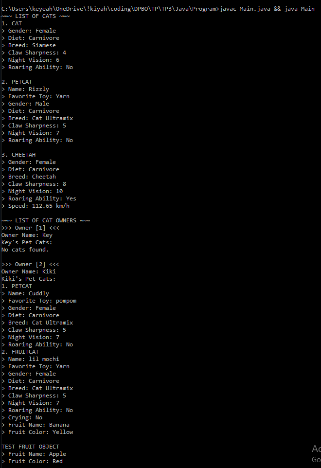

# Janji
Saya Zakiyah Hasanah dengan NIM 2305274 mengerjakan Tugas Praktikum 3 dalam mata kuliah Desain dan Pemrograman Berorientasi Objek untuk keberkahanNya maka saya tidak melakukan kecurangan seperti yang telah dispesifikasikan. Aamiin.


# Diagram

# Desain Program
Program ini mengimplementasikan konsep *hybrid inheritance* melalui diagram class yang menunjukkan hubungan antara class `Animal`, `Cat`, `PetCat`, `Cheetah`, `Fruit`, `FruitCat`, dan `CatOwner`. 

Pada diagram, `Cat` mewarisi `Animal`, sementara `PetCat` dan `Cheetah` mewarisi `Cat`. `FruitCat` adalah hasil dari *hybrid inheritance* yang mewarisi `PetCat` serta mengandung instance dari `Fruit`. 

`CatOwner` memiliki hubungan *composite* dengan `PetCat`, yang berarti `CatOwner` bertanggung jawab penuh atas siklus hidup objek `PetCat` yang dimilikinya. Jika `CatOwner` dihapus, semua `PetCat` yang dimilikinya juga akan dihapus.
- **`Animal`**: Class dasar dengan atribut `gender` dan `diet`.
- **`Cat`**: Turunan dari `Animal` dengan atribut tambahan seperti `breed`, `clawSharpness`, `nightVision`, dan `roaringAbility`.
- **`PetCat`**: Turunan dari `Cat` dengan atribut `name` dan `favoriteToy`.
- **`Cheetah`**: Turunan dari `Cat` dengan atribut `speed`.
- **`Fruit`**: Class terpisah yang menyimpan informasi tentang buah.
- **`FruitCat`**: Class hybrid yang menggabungkan `PetCat` dan `Fruit`.
- **`CatOwner`**: Class yang menyimpan daftar kucing yang dimiliki oleh pemilik.

### Catatan
Implementasi *hybrid inheritance* pada Java dicapai dengan menggunakan abstract class `Fruit`, memungkinkan `FruitCat` untuk mewarisi perilaku `PetCat` sambil tetap memiliki properti `Fruit`. 


# Alur Program
Fungsi `main()` berjalan melalui beberapa tahap:
1. Membuat array `Cat[]` yang berisi objek `Cat`, `PetCat`, dan `Cheetah`.
2. Menampilkan informasi dari setiap kucing.
3. Membuat array `CatOwner[]` untuk menyimpan beberapa pemilik kucing.
4. Menambahkan objek `PetCat` dan `FruitCat` ke suatu cat owner.
5. Menampilkan informasi setiap pemilik kucing beserta daftar kucing mereka.

## Dokumentasi

### Dokumentasi CPP
```
cd CPP/Program/
g++ *.cpp -o a&&./a
```


### Dokumentasi Java
```
cd Java/Program/
javac Main.java && java Main
```


### Dokumentasi Python
```
cd Python/Program/
py main.py
```


> :)

# Referensi Gambar
Contoh *fruit cats*:


Banana cat gang:


